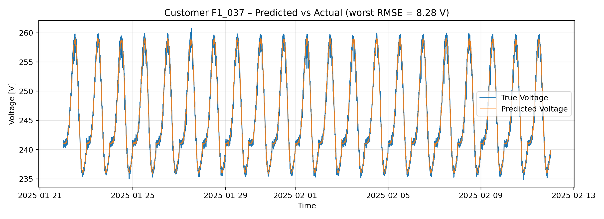
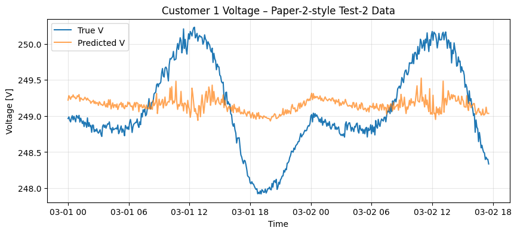

# AI-Enhanced Voltage Prediction for PV-Integrated Low-Voltage Grids

> **IEEE GPECOM 2026 publication** — data-driven voltage prediction and transfer learning for photovoltaic-rich low-voltage distribution networks.

This repository contains the research code supporting the paper **[AI-Enhanced Optimal Power Flow Modeling for PV-Integrated Low-Voltage Grids](https://doi.org/10.1109/GPECOM70462.2026.11578896)**, published at the **2026 8th Global Power, Energy and Communication Conference (GPECOM)**.

The project investigates whether neural networks can provide fast, accurate nodal-voltage predictions from smart-meter measurements, reducing reliance on detailed network models for real-time low-voltage-grid monitoring.



## Research context

Growing residential photovoltaic (PV) penetration can cause voltage rise and phase imbalance in low-voltage (LV) distribution networks. Conventional AC optimal power flow (OPF) requires accurate topology and electrical parameters that are not always available in real-world LV systems.

This work uses smart-meter and transformer measurements to predict customer nodal voltages directly. It evaluates a shallow neural-network baseline, Random Forest, deeper and regularized neural-network variants, and transfer learning across changing feeder and operating conditions.

## Key results

- Modelled a three-phase, 400 V LV network with four feeders and 146 single-phase customers.
- Used 295 inputs per time step: active and reactive power measurements for each customer plus three transformer phase voltages.
- The shallow neural-network baseline achieved **0.041 V test RMSE** on the baseline dataset, outperforming the Random Forest comparison.
- Transfer learning adapted pre-trained representations to unseen operating/network conditions, with reported RMSE values of **0.10 V**, **1.29 V**, and **3.35 V** across the evaluated target datasets; a tuned two-hidden-layer model reached **0.39 V** in the most extreme case.



## Repository contents

| File | Purpose |
| --- | --- |
| `Forest_VS_NN.py` | Builds the wide-format dataset, trains and compares Random Forest and neural-network models, and produces analysis plots. |
| `transfer_learning.py` | Fine-tunes pre-trained one- and two-hidden-layer neural networks on changed operating conditions and network configurations. |
| `tests.py` | Exploratory experiments with alternative neural-network architectures and data scenarios. |
| `figures/` | Selected result visualizations included for project presentation. |

## Data format

The original simulation/smart-meter datasets are intentionally not included in this public repository. Each script expects CSV files in long format with the following fields:

```text
timestamp, customer_id, phase, P_kW, Q_kVAR, V_tx_V, V_node_V
```

The `prepare_wide()` function in each script converts this into the model-ready input matrix:

```text
[P for all customers | Q for all customers | transformer voltage for phases A, B, C]
```

Before running a script, update its data-path variables to point to your local copies of the datasets. The paths are currently set to the original thesis data location and should be treated as examples rather than portable defaults.

## Setup

```bash
python3 -m venv .venv
source .venv/bin/activate
pip install -r requirements.txt
```

Run a study, for example:

```bash
python Forest_VS_NN.py
```

> Training requires the original CSV datasets. The trained `.h5` checkpoints and generated CSV exports are excluded from version control to keep the public repository lightweight; they can be regenerated from the source data or shared separately when appropriate.

## Publication

**Y. Saad, S. Elsherif, and Y. Zaghloul**, “AI-Enhanced Optimal Power Flow Modeling for PV-Integrated Low-Voltage Grids,” *2026 8th Global Power, Energy and Communication Conference (GPECOM)*, 2026. [https://doi.org/10.1109/GPECOM70462.2026.11578896](https://doi.org/10.1109/GPECOM70462.2026.11578896)

This repository is an implementation companion to the published work. Please cite the paper if you use or build upon it.

## Notes for reuse

- This is research code created for the bachelor-thesis and publication workflow.
- It is provided for learning, transparency, and reproducibility support.
- Please do not upload proprietary, sensitive, or unpublished grid data to a public repository.
